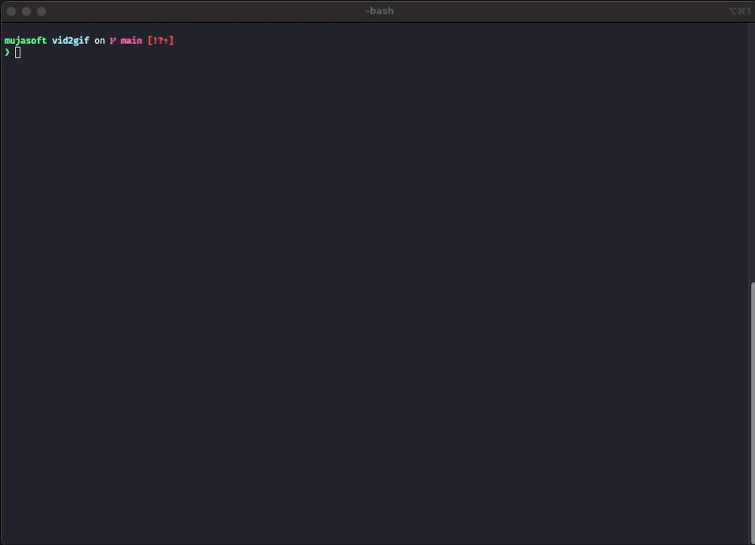

# gif4docs


[](https://github.com/mujasoft/homebrew-tools)


Convert video files into **optimized GIFs** using `ffmpeg` — perfect for README demos and lightweight previews.

> I found myself using this script often, so I made it a standalone tool — something you can drop into your `$PATH` and run whenever you need a clean GIF from a video.

Formerly known as "vid2gif".

## Demo



## Why this exists?

- Works **entirely offline** — nothing is ever uploaded
- Ideal for GitHub project demos, bug reproductions or sharing animations
- Easier and safer than uploading to unreliable online converters


## Features

- Converts `.mp4`, `.mov`, `.mkv`, `.webm`, etc.
- Uses palette generation for smaller, smoother GIFs.
- Cleans up temporary files after use.
- Can append timestamps to avoid overwriting output file.
- Fully **offline**, no external dependencies besides `ffmpeg`.
- Pure Bash implementation — portable & dependency-free (except `ffmpeg`)
- Batch mode

## Requirement(s)

[ffmpeg](https://ffmpeg.org) must be installed and in your `$PATH`

```bash
brew install ffmpeg
```

## Installation
### Option 1: Via Homebrew
```bash
brew tap mujasoft/tools
brew install gif4docs
```

### Option 2: Install globally.
```bash
chmod +x gif4docs
mv gif4docs /usr/local/bin/
```
### Option 3: Add to path
```bash
export PATH="$PATH:/path/to/this/repo"
```

## Usage

```bash
./gif4docs -i input.mov
./gif4docs -i clip.mp4 -o demo.gif
```

## Options

```bash
Usage: ./gif4docs -i <input_file> [-o <output_basename>] [-t]
       ./gif4docs -d <directory> [-t]

Convert a video file (.mp4, .mov, etc.) or an entire directory to optimized GIF(s) using FFmpeg.

This is a simple offline tool that can convert your screen recordings to GIFs that you can later
add to your READMEs, presentations and bug reproductions.

Options(s):
  -h, --help                Show this help message and exit
  -v, --version             Print version information and exit
  -t                        Append timestamp to output file

For single file mode:
  -i <file>                 Input video file (required for single file mode)
  -o <basename>             Output base name (default: output)

For batch mode:
  -d <input_folder>         Path to folder containing videos
  -k <output_folder>        Path to output folder. Defaults to input folder.

Examples:
  ./gif4docs -i demo.mov
  ./gif4docs -i video.mp4 -o demo -t # timestamps added
  ./gif4docs -d ./videos/ -t # batch mode

Output:
  GIF will be saved as: <output>.gif or <output>_YYYY-MM-DD_HH-MM-SS.gif
```

| Flag                | Description                                                           |
|--------------       |----------------------------------------------                         |
| `-i`                | Input video file (required)                                           |
| `-o`                | Output name (optional, default: `output`)                             |
| `-h --help`         | Show help message                                                     |
| `-d`                | Input folder                                                          |
| `-k`                | Output folder                                                         |
| `-v --version`      | Show tool version                                                     |
| `-t`                | Append a timestamp to output basename (Optional, default=False)       |


## How to run regression test suite?


You will need pytest.
```bash
pip3 install pytest
```

To run the entire suite:

```bash
pytest # it will automatically find the test folder
```
This suite tests:
- version no.
- help text
- single file mode
- output file mode

Example Output:
```bash
tests/test_gifs4docs.py::test_single_file_conversion PASSED                                                                             [ 25%]
tests/test_gifs4docs.py::test_version PASSED                                                                                            [ 50%]
tests/test_gifs4docs.py::test_help PASSED                                                                                               [ 75%]
tests/test_gifs4docs.py::test_batch_file_conversion PASSED                                                                              [100%]

============================================================== 4 passed in 1.29s ==============================================================

```


## Why the rename?

The project was renamed from `vid2gif` to `gif4docs` to avoid naming conflicts and better reflect its purpose of generating optimized GIFs for technical documentation.

## License

MIT License — see [LICENSE](./LICENSE) for details.
