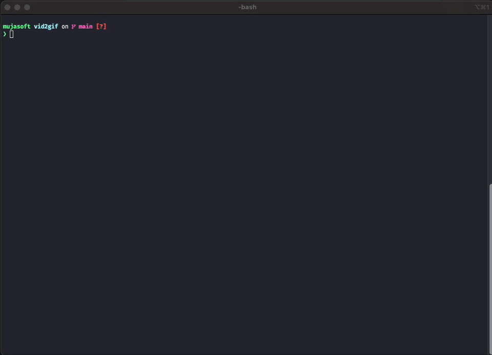

# vid2gif


Convert video files into **optimized GIFs** using `ffmpeg` — perfect for README demos and lightweight previews.

> I found myself using this script often, so I made it a standalone tool — something you can drop into your `$PATH` and run whenever you need a clean GIF from a video.

## Demo



## Features

- Converts `.mp4`, `.mov`, `.mkv`, `.webm`, and more.
- Uses palette generation for smaller, smoother GIFs.
- Cleans up temporary files after use.
- Appends timestamps to avoid overwriting.
- Fully **offline**, no external dependencies besides `ffmpeg`.
- Pure Bash implementation — portable & dependency-free (except `ffmpeg`)


## Usage

```bash
./vid2gif -i input.mov
./vid2gif -i clip.mp4 -o demo_gif
```

## Output
GIF will be saved as:
```bash
<output>_YYYY-MM-DD_HH-MM-SS.gif
```

## Options

| Flag                | Description                                  |
|--------------       |----------------------------------------------|
| `-i`                | Input video file (required)                  |
| `-o`                | Output basename (optional, default: `output`)|
| `-h --help`         | Show help message                            |
| `-v --version`      | Show tool version                            |


## Requirement(s)

[ffmpeg](https://ffmpeg.org) must be installed and in your `$PATH`

```bash
# macOS (Homebrew)
brew install ffmpeg
```


## License

MIT License — see [LICENSE](./LICENSE) for details.